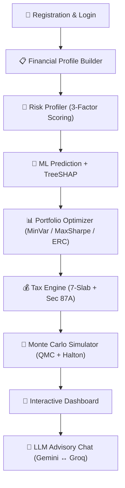

<p align="center">
  
</p>

<p align="center">
  
  
  
  
  
  
  
  
</p>

<p align="center">
  <a href="LICENSE"></a>
  
  
  
  
</p>

<h1 align="center">WealthGenie: AI-Powered Personalized Financial Advisory System</h1>

<p align="center">
  <strong>A production-grade, three-tier robo-advisory platform integrating Quasi-Monte Carlo simulation, explainable ML (TreeSHAP), progressive tax optimization under Indian Finance Act 2025, and LLM-powered conversational advisory.</strong>
</p>

<p align="center">
  <a href="#-why-wealthgenie">Why WealthGenie?</a> •
  <a href="#-architecture">Architecture</a> •
  <a href="#-key-features">Key Features</a> •
  <a href="#-computational-engines">Computational Engines</a> •
  <a href="#-quick-start">Quick Start</a> •
  <a href="#-api-reference">API Reference</a>
</p>

---

## 💡 Why WealthGenie?

WealthGenie combines advanced financial modeling and explainable machine learning into a single unified robo-advisory platform:
- **Quasi-Monte Carlo stochastic simulation** mapping $P_{10}$ / $P_{50}$ / $P_{90}$ wealth bands.
- **Explainable ML recommendations** with TreeSHAP feature attributions.
- **Three-strategy portfolio optimization** (MinVariance / MaxSharpe / Equal Risk Contribution).
- **Progressive tax engine** with Section 87A rebate cliff and marginal relief detection.
- **109 investment instruments** across 12 asset classes.
- **Dual-LLM advisory chat** grounded in computational outputs.

---

## 🏗 Architecture

WealthGenie operates on a decoupled service-oriented architecture communicating over stateless REST APIs:



---

## ✨ Key Features

### Stochastic Wealth Projection
- **Quasi-Monte Carlo simulation** using Halton low-discrepancy sequences replaces deterministic CAGR projections.
- **Antithetic variates** and **multiplicative control variates** achieve high variance reduction.
- Renders probabilistic wealth bands ($P_{10}$, $P_{50}$, $P_{90}$) capturing sequence-of-returns risk for SIP investors.

### Portfolio Optimization (3 Strategies)
- **Minimum Variance**: Minimizes $w^T \Sigma w$ for lowest-risk allocation.
- **Maximum Sharpe**: Maximizes risk-adjusted excess return $(w^T\mu - R_f) / \sqrt{w^T\Sigma w}$.
- **Equal Risk Contribution (Risk Parity)**: Equalizes marginal risk contributions across all assets.
- Enforces simplex constraints (fully-invested and long-only) using Euclidean projection onto the probability simplex.

### Explainable AI (XAI)
- **Random Forest** ensemble classifier (100 trees) maps investor profiles to recommended primary financial instruments.
- **TreeSHAP** computes exact Shapley values satisfying efficiency, symmetry, and dummy axioms.
- Attributions decompose every recommendation into auditable, human-readable explanations.

### Indian Tax Engine (FY2025-26 / FY2026-27 Slabs)
- 7-slab progressive tax computation (0% → 30%).
- **Section 87A rebate cliff** with marginal relief — handles the ₹12,00,000 threshold discontinuity.
- Surcharge tiers (10% / 15% / 25%) with surcharge marginal relief.
- Standard deduction (₹75,000) and 4% Health & Education Cess.
- Old vs New regime comparison, including post-tax capital gains analysis (LTCG / STCG / EEE classification).

### Dual-LLM Advisory Chat
- **Primary**: Google Gemini 2.0 with context injection from validated computational outputs.
- **Failover**: Groq Llama 3.3 with deterministic prompt reformatting.
- Prompt caching via Upstash Redis (30-minute TTL) to optimize LLM token costs.

### Production-Grade Security
- bcrypt password hashing (cost factor 10).
- JWT HS256 authentication with configurable expiration.
- Timing-attack resistant login (constant-time dummy-hash comparisons for non-existent users).
- Rate limiting (10 auth / 60 API requests per window) with Redis store and in-memory fallback.
- Helmet.js security headers, NoSQL injection prevention, and strict Content-Type validation.

### Decoupled 109-Instrument Catalog
- Authoritative database containing **109 diverse investment options** across 12 asset classes.
- Custom client-side eligibility validation checks age, income, savings capacity, and demographic constraints.

---

## ⚙️ Computational Engines

### 1. Quasi-Monte Carlo Simulator (`monteCarloEngine.js`)
Models wealth growth via Geometric Brownian Motion with monthly SIP contributions:
$$S(t + \Delta t) = \left(S(t) + P_m\right) \exp\left[\left(\mu - \frac{\sigma^2}{2}\right)\Delta t + \sigma\sqrt{\Delta t}\, Z_t\right]$$
Uses **Halton low-discrepancy sequences**, **Antithetic Variates**, and **Multiplicative Control Variates** to achieve variance reduction.

### 2. Hybrid XIRR Solver (`xirrCalculator.js`)
Solves for the annualized discount rate $r$ satisfying:
$$f(r) = \sum_{i=0}^{M} C_i (1+r)^{-d_i} = 0$$
Features a three-phase algorithm: Interval Bracketing, Bisection, and Newton-Raphson with Brent's method fallback.

### 3. Portfolio Optimizer (`portfolioEngine.js`)
Computes optimal weights for strategies (MinVariance / MaxSharpe / Equal Risk Contribution) across assets (Equity MF, FD, Gold, G-Sec).
Constraints are enforced at every gradient step via Euclidean projection onto the probability simplex. Safe covariance matrix fallbacks prevent runtime crashes.

### 4. Progressive Tax Engine (`taxEngine.js`)
Implements the New Tax Regime (FY2025-26):
- Slab thresholds: ₹0-4L (0%), ₹4-8L (5%), ₹8-12L (10%), ₹12-16L (15%), ₹16-20L (20%), ₹20-24L (25%), Above ₹24L (30%).
- Section 87A rebate cliff and marginal relief:
$$T_{\text{base}} = \begin{cases} 0, & I_{\text{tax}} \le 12{,}00{,}000 \\ \min(T_{\text{slab}},\, I_{\text{tax}} - 12{,}00{,}000), & I_{\text{tax}} > 12{,}00{,}000 \end{cases}$$

### 5. Risk Profiler (`riskProfiler.js`)
Computes composite risk score (1-10) using age-based capacity, subjective risk tolerance, and investment horizon.

### 6. Projection Engine (`projectionEngine.js`)
Standardizes returns compounding algorithms:
- **Monthly Compounding (SIP)**: $FV_{\text{SIP}} = P_m \times \frac{(1 + r/12)^N - 1}{r/12} \times (1 + r/12)$
- **Annual Compounding (Lump Sum)**: $FV_{\text{Lump}} = P \times (1 + r)^Y$
- **Discrete CAGR**: $\text{CAGR} = \left(\frac{FV}{PV}\right)^{1/Y} - 1$

---

## 🛠️ Technology Stack

### Frontend
- **React 19.2**: Component-based state management.
- **Vite 8.0**: Fast build and dev server.
- **React Router 7.14**: Client-side routing.
- **Framer Motion 12.38**: Micro-animations and transitions.
- **Recharts 3.8**: SVG-based financial charting.
- **jsPDF 4.2**: Client-side PDF export.

### Backend
- **Node.js / Express 4.21**: REST API server.
- **Mongoose 8.8**: MongoDB ODM with validation.
- **JWT (jsonwebtoken) 9.0**: Authentication and authorization.
- **bcryptjs 2.4**: Safe password hashing.
- **Helmet 8.0**: HTTP security headers.
- **express-rate-limit 8.5**: IP rate limiting.
- **Redis 4.7**: Upstash-backed caching and rate limiting.
- **Joi 18.1**: Request validation schemas.

### ML Microservice
- **FastAPI 0.115**: Async python framework.
- **Scikit-learn 1.5.2**: RandomForest classifier.
- **SHAP 0.46**: TreeSHAP feature attributions.
- **Pydantic 2.9**: Request/response schemas.

---

## 📁 Repository Structure

```
.
├── reactapp/                  # Frontend Application
│   ├── src/
│   │   ├── components/        # React components (Sidebar, GenieChat, TaxScreen, Rebalancer, etc.)
│   │   ├── context/           # React context (UserContext.jsx)
│   │   ├── services/          # API Client (api.js)
│   │   ├── utils/             # Local utilities (tax, SIP, formatting, explainers)
│   │   ├── main.jsx           # Mounting entrypoint
│   │   └── App.jsx            # Application shell
│   ├── Dockerfile
│   └── vite.config.js
│
├── server/                    # API Backend Server
│   ├── config/                # Database and Redis connections, seeder
│   ├── middleware/            # JWT auth, rate limits, error handler
│   ├── models/                # MongoDB Mongoose schemas
│   ├── routes/                # Express controllers (auth, profiles, recommendations, tax, etc.)
│   ├── services/              # Computational and third-party engines
│   ├── validation/            # Joi validation schemas
│   ├── server.js              # Entrypoint
│   └── Dockerfile
│
├── ml-service/                # Python ML Microservice
│   ├── model/                 # Training script, encoders, and model PKLs
│   ├── tests/                 # FastAPI and model unit tests
│   ├── main.py                # Server routes (/predict/enriched)
│   ├── requirements.txt
│   └── Dockerfile
│
└── shared/                    # Authoritative static assets
    ├── investment_master.json # 109-instrument data
    └── investment.schema.json # Instrument validation schema
```

---

## 🚀 Getting Started

### Prerequisites
- **Node.js**: $\ge$ 20.x
- **Python**: $\ge$ 3.12
- **MongoDB**: $\ge$ 6.0
- **Redis**: $\ge$ 7.0

### Installation

1. **Clone the Repository**
   ```bash
   git clone https://github.com/yashaskn8/deploy-wealthgenie.git
   cd deploy-wealthgenie
   ```

2. **Backend Setup**
   ```bash
   cd server
   cp .env.example .env
   npm install
   ```

3. **ML Microservice Setup**
   ```bash
   cd ../ml-service
   python -m venv .venv
   source .venv/bin/activate  # On Windows use: .\.venv\Scripts\activate
   pip install -r requirements.txt
   python model/train.py      # Generate model files (first run only)
   ```

4. **Frontend Setup**
   ```bash
   cd ../reactapp
   npm install
   ```

### Running Locally

Run each service in separate terminal windows:

```bash
# Terminal 1: ML FastAPI Service (Port 8000)
cd ml-service && source .venv/bin/activate && python -m uvicorn main:app --host 127.0.0.1 --port 8000

# Terminal 2: Node.js API Server (Port 5000)
cd server && npm run dev

# Terminal 3: React Vite App (Port 5173)
cd reactapp && npm run dev
```

### Docker Compose Run

Spins up the entire multi-container architecture locally:

```bash
cp .env.example .env
docker compose up --build -d
```
- **Frontend UI**: http://localhost:80
- **Express API**: http://localhost:5000
- **ML FastAPI**: http://localhost:8000

---

## 🔌 API Reference

### Authentication
- `POST /api/auth/register` - Create user.
- `POST /api/auth/login` - Authenticate and return JWT token.

### Financial Profile
- `POST /api/profile/build` - Submit demographic/financial profile.

### Recommendation & Portfolio
- `POST /api/recommend` - Generate recommendations with SHAP explanations.
- `POST /api/recommend/weights` - Update instrument weights.
- `POST /api/portfolio/optimise` - Compute optimized weights.
- `POST /api/portfolio/rebalance` - Calculate rebalancing drift.

### Calculations & Projections
- `POST /api/montecarlo/montecarlo` - QMC stochastic simulation.
- `POST /api/projection` - Deterministic Fisher-adjusted projections.
- `POST /api/projection/xirr` - Cash flow XIRR calculation.
- `GET /api/tax/compute` - Calculate progressive tax.
- `GET /api/tax/compare` - Compare Old vs New regimes.

### Goals
- `POST /api/goals/create` - Create goal.
- `GET /api/goals` - Fetch user goals.
- `PATCH /api/goals/:goalId` - Update goal params.
- `DELETE /api/goals/:goalId` - Delete goal.

---

## 🔒 Environment Variables

| Variable | Required | Description | Default |
|:---|:---|:---|:---|
| `PORT` | No | Port for Express API | `5000` |
| `NODE_ENV` | No | Execution environment | `development` |
| `MONGODB_URI` | Yes | MongoDB Connection string | `mongodb://localhost:27017/wealthgenie` |
| `REDIS_URL` | No | Upstash or local Redis URI | `redis://localhost:6379` |
| `JWT_SECRET` | Yes | HS256 signing secret key | — |
| `JWT_EXPIRES_IN` | No | Session timeout | `7d` |
| `ML_SERVICE_URL` | No | FastAPI Microservice endpoint | `http://localhost:8000` |
| `ML_SERVICE_API_KEY`| Yes | Shared secret API key | — |
| `GEMINI_API_KEY` | No | Google Gemini API key | — |
| `GROQ_API_KEY` | No | Groq fallback API key | — |
| `VITE_API_URL` | No | Frontend API routing base | `http://localhost:5000/api` |

---

## 🧪 Testing

### Running Tests

```bash
# Frontend tests (Vitest)
cd reactapp && npm run test

# Backend tests (Node --test)
cd server && npm run test

# ML Service tests (Pytest)
cd ml-service && python -m pytest
```

---

## 👤 Credits & License

- **Author**: Yashas K N (<yashaskn08@gmail.com>)
- **License**: MIT License - see the [LICENSE](LICENSE) file for details.
