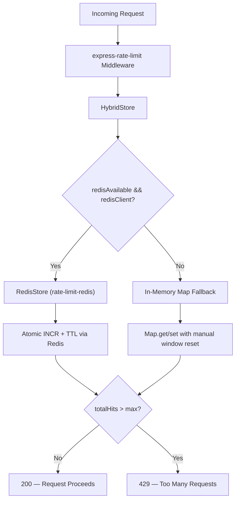

# Rate Limiting Architecture — Design Document

> Last Updated: 2026-07-24

## Architecture Overview

## Normal Flow (Redis Connected)

1. `redisAvailable` is set to `true` by the `connect` event handler in `config/redis.js:36-38`.
2. `HybridStore.getStore()` returns a `RedisStore` instance backed by `redisClient.sendCommand()`.
3. `RedisStore.increment(key)` executes an atomic `INCR` + `PEXPIRE` on the Redis server.
4. Rate limit state is **shared across all server instances** (consistent cluster behavior).
5. The `passOnStoreError: true` flag ensures that if a Redis command fails mid-request, the request is allowed through rather than erroring out.

## Degraded Flow (Redis Unavailable)

1. If Redis fails to connect, `redisAvailable` remains `false` (set in `config/redis.js:32,44`).
2. If Redis disconnects after initial connection, the `error` event handler sets `redisAvailable = false` (`config/redis.js:32`).
3. `HybridStore.getStore()` returns `null`.
4. `HybridStore.increment(key)` falls back to a per-process `Map<string, {count, resetTime}>`.
5. The in-memory map tracks hit counts per key with manual window expiration logic.
6. Rate limiting continues to function **per-process** but is **not shared across instances**.

## Key Design Questions & Answers

### 1. Is Redis the primary store?

**Yes.** `HybridStore.getStore()` checks `redisAvailable && redisClient` first (line 13). The `RedisStore` is instantiated lazily and reused. In-memory is only reached when `getStore()` returns `null`.

### 2. Is in-memory fallback ONLY activated when Redis is unavailable?

**Yes.** The in-memory code path (`this.hits.get/set`) is only reached when `getStore()` returns `null`, which only happens when `redisAvailable === false || redisClient === null`. This is verified by the conditional on line 27: `if (store) return store.increment(key);`.

### 3. Is fallback temporary rather than permanent?

**Yes.** The `redisAvailable` flag is reactive:
- Set to `true` on `connect` event (`redis.js:37`).
- Set to `false` on `error` event (`redis.js:32`).
- The reconnect strategy retries up to 5 times with exponential backoff (`redis.js:17-21`).

When Redis reconnects, `redisAvailable` flips back to `true`, and `HybridStore.getStore()` returns the `RedisStore` again. The in-memory `Map` data becomes stale but harmless (it is not cleared, but is simply bypassed).

### 4. Can multiple server instances produce inconsistent limits during fallback?

**Yes — this is an intentional trade-off.**

During Redis outages, each Node.js process maintains its own independent `Map`. This means:
- A user could make `max` requests to **each** instance before being rate-limited.
- In a 3-instance cluster with `max=10`, a user could theoretically make up to 30 requests during a Redis outage window.

### Trade-off: Availability over Cluster Consistency

| Dimension | Redis Connected | Redis Down (Fallback) |
|:---|:---|:---|
| **Consistency** | Full cluster-wide consistency | Per-process only |
| **Availability** | Full | Full (no 500 errors) |
| **Max requests during outage** | `max` per window | `max × N` per window (N = instances) |
| **Duration** | Permanent | Temporary (reconnect within ~15s) |

**Rationale:** For a financial advisory platform, availability is prioritized over strict rate-limit consistency. A brief window of relaxed limits during a Redis outage is preferable to:
- Returning 500 errors to all users (if rate limiting fails hard).
- Silently allowing unlimited requests (the previous behavior before the `HybridStore` fix).

The `passOnStoreError: true` flag provides an additional safety net: if the Redis command itself throws mid-execution, the request is allowed through rather than producing an unhandled error.

## Limiter Instances

| Limiter | Window | Max | Prefix | Used On |
|:---|:---|:---|:---|:---|
| `authLimiter` | 15 min | 100 | `rl:auth:` | `/api/auth/*` |
| `apiLimiter` | 1 min | 1000 | `rl:api:` | All `/api/*` routes |
| `createEndpointRateLimiter()` | Configurable (default 1 min) | Configurable (default 10) | `rl:ep:` | Chat, Monte Carlo, Portfolio |

## File References

- [rateLimiter.js](file:///c:/Users/prana/OneDrive/Desktop/deploy-wealthgenie/server/middleware/rateLimiter.js) — HybridStore + limiter exports
- [redis.js](file:///c:/Users/prana/OneDrive/Desktop/deploy-wealthgenie/server/config/redis.js) — Connection, reconnect, `redisAvailable` flag
- [securityTasks345.test.js](file:///c:/Users/prana/OneDrive/Desktop/deploy-wealthgenie/server/test/securityTasks345.test.js) — Rate limiter boundary test (10 pass, 11th → 429)
